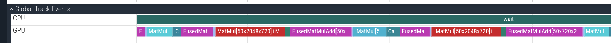

# meganeura

[](https://github.com/kvark/meganeura/actions/workflows/ci.yml)
[](https://docs.rs/meganeura)
[](https://crates.io/crates/meganeura)

Cross-platform neural network training and inference in Rust.


```rust
use meganeura::{Graph, Trainer, TrainConfig, DataLoader, build_session};

let mut g = Graph::new();
let x = g.input("x", &[32, 784]);
let labels = g.input("labels", &[32, 10]);

let w1 = g.parameter("w1", &[784, 128]);
let h = g.relu(g.matmul(x, w1));

let w2 = g.parameter("w2", &[128, 10]);
let logits = g.matmul(h, w2);
let loss = g.cross_entropy_loss(logits, labels);
g.set_outputs(vec![loss]);

// autodiff + e-graph optimize + compile + GPU init
let session = build_session(&g);
let mut trainer = Trainer::new(session, TrainConfig::default());
trainer.train(&mut data, 10);
```

That's the full pipeline: define a graph, call `build_session`, train. Meganeura handles autodiff, [e-graph](https://egraphs-good.github.io/) kernel fusion, shader generation, and GPU dispatch automatically.

## Why Meganeura?

- **Portable.** Powered by [blade-graphics](https://github.com/kvark/blade/tree/main/blade-graphics) for GPU access across Linux, Windows, macOS, iOS, and Android. Runs on anything with Vulkan (including Mesa's [Lavapipe](https://www.phoronix.com/news/Lavapipe-CPU-Vulkan-Windows) for CI).

- **Fast.** Competitive with PyTorch CUDA on NVIDIA, and faster than PyTorch ROCm/MPS on AMD and Apple GPUs. On RTX 5080: SmolLM2-135M inference in 7ms (PyTorch: 4ms), SmolVLA training within 1.3x of CUDA. On Radeon 890M: SmolVLA training is 15% faster than ROCm. See [Inferena](https://inferena.tech) for full cross-framework benchmarks.

- **Lean.** A handful of [kernel archetypes](docs/kernel-archetypes.md) (pointwise, reduction, matmul, attention) compose into specialized GPU shaders at compile time. E-graph equality saturation discovers optimal kernel fusions with a cost-model-driven extractor.

## Quick Start

```sh
cargo add meganeura
```

See [`examples/mnist.rs`](examples/mnist.rs) for a complete MNIST training example, or [`examples/smollm2.rs`](examples/smollm2.rs) for LLM inference with HuggingFace weights.

### Inference

```rust
use meganeura::{Graph, build_inference_session, models::resnet};

let mut g = Graph::new();
let logits = resnet::build_graph(&mut g, 1); // batch=1
g.set_outputs(vec![logits]);

let mut session = build_inference_session(&g);
// load weights, set input, run:
session.set_input("image", &image_data);
session.step();
session.wait();
let output = session.read_output(1000); // 1000 ImageNet classes
```

### Standard Model Loading

Load models from interchange formats without manual graph construction:

```rust
// ONNX
let model = meganeura::load_onnx("model.onnx")?;
let session = build_inference_session(&model.graph);

// NNEF
let model = meganeura::load_nnef("model_dir/")?;
```

Both loaders translate to Meganeura's IR where the e-graph optimizer discovers kernel fusions (e.g. `x * sigmoid(x)` -> Silu, `Silu(gate) * up` -> SwiGLU) before compilation.

## System Requirements

Runs best when cooperative matrix operations are hardware-accelerated:
- **Vulkan**: [VK_KHR_cooperative_matrix](https://registry.khronos.org/vulkan/specs/latest/man/html/VK_KHR_cooperative_matrix.html) (NVIDIA Volta+, AMD RDNA3+, Intel Arc)
- **Metal**: Apple GPU with simdgroup matrix support (M1+)

Falls back to scalar matmul on other hardware. Works on Lavapipe for CI.

## Profiling

Set `MEGANEURA_TRACE=trace.pftrace` to capture [Perfetto](https://ui.perfetto.dev/#!/viewer) traces:


