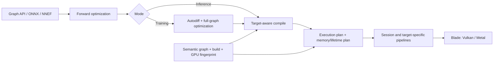

# Meganeura project audit — 2026-07-12

## Executive verdict

Meganeura is moving in the right direction. Its central thesis is coherent:
use a typed static graph, equality-saturation-assisted optimization, a small set
of composable kernel archetypes, Naga shader generation, and Blade's portable
graphics abstraction to make training and inference competitive without a
vendor-specific CUDA layer. The code demonstrates that this is more than a
positioning statement: autodiff, attention backward, graph optimization,
memory planning, quantization, checkpointing, and real model builders all pass
through the same execution model.

The main concern is not the direction; it is that performance development has
outpaced correctness boundaries, release engineering, and target-matrix
evidence. Before this audit, an unsafe checkpoint copy could overrun mapped
memory, the plan cache could reuse semantically or hardware-incompatible
plans, compilation could target a different adapter than execution, and
mixed-width attention could bind the wrong pipeline. Those are systemic
integration faults, not isolated arithmetic mistakes. They are fixed in the
current working tree and covered by regression tests.

The concise assessment is therefore: **continue the strategy, but require
target-aware compilation, semantic cache keys, strict resource and file-format
boundaries, and real-vendor release qualification as non-negotiable
infrastructure.**

| Area | Assessment | Rationale |
|---|---|---|
| Product intent | Strong | Clear non-CUDA portability wedge, real training scope, and honest performance losses in the README/roadmap. |
| Core architecture | Sound, with boundary debt | The graph-to-plan pipeline fits the goal; compile/runtime variant ownership and very large modules blur responsibilities. |
| Optimizer strategy | Promising and differentiated | Traffic-aware extraction and repeated-region outlining support the archetype thesis; extracted terms and direct pattern appliers still share ownership. |
| Correctness | Materially improved by this audit | Broad numerical tests exist, but several cross-subsystem invariants were previously unguarded. |
| Portability | Designed in, incompletely evidenced | Vulkan and Metal are exercised in hosted CI; Windows Vulkan is now compile-gated. Real AMD is verified locally, but real NVIDIA remains a release gate. |
| Testing | Broad but uneven | Strong shader, autodiff, optimizer, and GPU integration coverage; weak file-corruption, multi-device, and vendor-driver coverage before this audit. |
| API/product maturity | Early | Useful high-level entry points coexist with public compiler internals, panics/assertions, and partial importer/training coverage. |
| Release/security discipline | Improving, still blocked | Strict quality/MSRV/security/package gates were added; a crates.io Blade release is still required for full package verification. |

## Scope and evidence

The audit covered the repository's intent, public documentation, 47,000+
lines of tracked Rust, graph IR and shape rules, autodiff, e-graph optimizer,
outlining, schedules, compilation, shader generation, memory planning,
runtime ownership, training APIs, checkpoint/cache formats, importers, model
builders, examples, benchmarks, dependencies, and CI.

Evidence included:

- source and history review across `src/`, `tests/`, `examples/`, `bench/`, and
  `docs/`;
- strict formatting, all-target compilation and Clippy, rustdoc, MSRV, package,
  and RustSec checks;
- the complete test suite on Vulkan/RADV;
- explicit scalar and 16×16 f16 cooperative-attention runs on an AMD RX 7900 XT;
- scalar fallback on the host AMD integrated adapter;
- offline WGSL validation and SPIR-V generation for scalar and f16-only
  cooperative target paths;
- malformed checkpoint and mixed-attention-width regression tests.

No NVIDIA, Metal, Windows Vulkan, iOS, or Android driver was available locally. The
NVIDIA conclusions below distinguish offline coverage from actual driver
evidence. Published benchmark numbers were reviewed for consistency but were
not independently re-benchmarked across every model.

## Intent and architectural coherence

The repository consistently describes four important choices:

1. Training is a first-class goal, not an inference-only afterthought.
2. Portable graphics APIs and generated shaders replace vendor compute stacks.
3. A few kernel templates should compose into model-specific programs instead
   of accumulating a hand-written kernel for every model pattern.
4. Optimization decisions should increasingly be extracted from graph and
   traffic cost, not fixed pattern folklore.

Those choices reinforce each other. A static graph exposes whole-program
autodiff, fusion, buffer lifetimes, and dispatch ordering. Naga gives the same
generated program a path to SPIR-V and Metal. The schedule/kernel-archetype
layer keeps code generation from becoming a model-name switch. Buffer aliasing
and device-local intermediates exploit information already present in the
execution plan.

The effective pipeline is:

Three architectural tensions deserve active management:

- **Variant selection has two owners.** Attention is now selected against
  explicit compile-time capabilities, but ordinary matmul/conv geometry is
  still selected in `compile.rs` and rewritten in `runtime.rs`, while pipeline
  lookup has fallback logic of its own. Roadmap A2 correctly identifies this.
- **The optimizer is transitional.** Equality saturation, extracted choices,
  and direct post-extraction pattern appliers coexist. Repeated-region
  outlining is a good answer to graph scale, but stamping extracted terms and
  cross-region fusion are still open.
- **Internal layers are effectively public API.** `lib.rs` publicly exposes
  graph, optimizer, compiler, schedule, codegen, memory planner, and runtime
  modules. This is useful for experimentation, but it makes refactoring harder
  and weakens the promise implied by a simple `build()` entry point.

## Implementation assessment

### Graph IR and autodiff

The IR is compact and readable, and op payloads carry most geometry needed by
code generation. Tensor dtypes and shapes are explicit, derived parameters
survive autodiff, and tests cover mid-graph chain-rule failures rather than
only final-loss cases. That is the right testing philosophy.

The limitations are also explicit in code. Most shape validation uses
assertions, shapes are predominantly static, and depthwise convolution plus
EfficientNet's channel-wise SE/BN operations do not have autodiff. Public
documentation should not imply arbitrary training coverage for every imported
or built model until unsupported backward paths return structured errors.

### Optimization and scheduling

Traffic-aware extraction and structural outlining are aligned with the stated
research direction. The repository also keeps rejected-optimization notes and
wall-clock guidance, which is unusually healthy for a performance project.

The remaining risk is decision coherence. Some extracted choices only gate
later hand-written appliers, large graphs use outlined samples plus global
rewrites, and several environment flags alter optimization. This is workable,
but every plan-affecting switch must remain in the cache fingerprint, and
optimization reports should eventually explain the selected alternative and
estimated bytes saved per region.

### Compiler and code generation

The compiler lowers to a concrete static dispatch plan, and shader generation
validates Naga modules. Offline SPIR-V coverage now includes attention forward
and backward, including the 16×16 f16 cooperative path representative of
f16-only Vulkan capability sets. Cooperative selection now requires exactly a
16×16 advertised tile instead of treating any tile of at least 16 as
compatible with hard-coded 16×16 kernels.

The biggest remaining structural debt is A2: pipeline key, geometry, padding,
and capability choice should be one atomic selected variant. Until then, every
new epilogue, weight format, small-tile path, or cooperative path must be
checked across compiler emission, runtime rewrites, pipeline construction, and
lookup.

### Runtime and memory

The lifetime planner, pinned-buffer rules, device-local intermediates, and
shared-context support are strong foundations. They acknowledge UMA versus
discrete memory behavior without forking the model API.

The runtime is also the largest concentration of risk: `runtime.rs` is over
5,000 lines and owns device probing, pipeline families, memory allocation,
binding, dispatch data, submission, optimizer state, external buffers,
profiling, quantization, checkpoints, and destruction. Splitting it by
resource ownership and lifecycle would make safety review much easier.

This audit fixed missing pipeline/buffer destruction and made host writes wait
for the prior submission. Those bugs show why resource-owning types should
ideally encapsulate destruction and mapped-write synchronization rather than
relying on one large `Drop` implementation and caller discipline.

### Training, persistence, and data

The high-level training API is appropriately small, with SGD/Adam/AdamW,
gradient clipping, accumulation, metrics, and checkpoint state. The checkpoint
format now validates byte lengths and storage dtypes before unsafe copies, and
malformed metadata returns `InvalidData`. Packed Q4/Q8 data is stored as bytes
instead of being falsely labelled f32.

Checkpoint loading is still a permissive, partial restore: missing parameters
warn and continue, and validation is not transactional across the entire file.
A future format should include a graph/parameter manifest, logical shapes,
weight formats, endianness/version policy, and an explicit strict-versus-partial
load mode.

`DataLoader` now rejects zero batch and sample sizes. Its current in-memory,
fixed-size sample model is sufficient for examples but not yet a general data
pipeline for variable-length or streaming workloads.

### Importers and models

The model collection proves that the core can express transformers, vision,
speech, and diffusion workloads. ONNX and NNEF import through the common IR,
which preserves the architectural thesis. Operator coverage is still narrow
relative to the README's general framework language, and model-specific
weight transforms/naming remain spread across builders and examples. Importer
capability tables and golden model fixtures would make support boundaries much
clearer.

## Findings

### Corrected in this working tree

| ID | Severity | Finding | Resolution |
|---|---|---|---|
| A-001 | Critical | Checkpoint Adam tensors were copied at attacker/file-controlled lengths into mapped GPU buffers. | Exact byte-length and dtype checks precede every copy; malformed metadata is rejected. Regression tests cover oversized state and invalid step metadata. |
| A-002 | High | The plan-cache hash omitted op attributes, dtypes, constants, derived parameters, compile options, mode, environment choices, and GPU capabilities. | Cache format v2 uses a semantic graph fingerprint plus a build/target fingerprint and cleanly rejects old or mismatched plans. |
| A-003 | High | Default `build()` compiled before opening the execution GPU and inherited a process-global first capability snapshot. Multi-adapter processes could compile the wrong path. | The actual/shared context is opened first, capabilities are probed explicitly, compilation uses those capabilities, and the cache includes them. |
| A-004 | High | All attention pipelines used one last-seen head dimension, so graphs mixing vision/text widths could execute the wrong shader. | Attention pipelines are keyed by `(shader entry, head dimension)`; mixed-width output parity is tested. |
| A-005 | High | Specialized weight pipelines, attention pipelines, gradient-clip storage, and accumulation storage leaked; mapped host writes could race an in-flight step. | Teardown covers all owned resources, and public host-write paths wait before modifying shared allocations. |
| A-006 | Medium | `DataLoader` accepted zero divisors, and a hard-coded 16×16 path accepted larger advertised tile sizes. | Constructors reject zero sizes; capability checks require the exact tile. |
| A-007 | Medium | Formatting, all-target lints, and rustdoc were not enforced; strict rustdoc found many broken links. | The tree is formatted, all-target Clippy and strict rustdoc pass, and CI enforces them. |
| A-008 | Medium | Git dependencies lacked registry version requirements, so `cargo package` could not even assemble a crate. | Compatible version requirements were added alongside pinned revisions; package assembly succeeds. Full verification remains A-104. |
| A-009 | High | On cooperative-matrix Vulkan contexts, Blade enables `vulkanMemoryModel` without `vulkanMemoryModelDeviceScope`; the gradient-clipping storage atomic therefore triggered VUID 06265 and was not portable to strict drivers. | Gradient norms now accumulate through ordinary f32 read/add/write dispatches separated by explicit compute barriers. The RX 7900 XT validation run no longer emits VUID 06265, and clipping parity tests pass. |
| A-010 | Medium | The README claimed a DX12 backend, but the pinned Blade revision selects Vulkan on Windows and contains Vulkan, Metal, and GLES implementations only. | Backend claims, comparison tables, and the Windows CI label now state the implemented Vulkan/Metal support. |

### Open risks and gaps

| ID | Priority | Gap | Recommended action / exit criterion |
|---|---|---|---|
| A-101 | P0 release gate | No continuous real AMD/NVIDIA hardware lane; software Vulkan cannot reproduce vendor cooperative-matrix and subgroup behavior. | Before release, run scalar and default paths on at least one RDNA3 and one current NVIDIA adapter, including full tests, flash fwd/bwd parity, long training smoke, and leak/validation output. Add self-hosted runners when stable. |
| A-102 | P1 | Naga SPIR-V currently emits `ArrayStride` on workgroup arrays, producing Vulkan VUID 10684 validation noise. wgpu tracks/suppresses this known issue, Blade does not. | Resolve or narrowly suppress only this known diagnostic, tracking [wgpu issue #7696](https://github.com/gfx-rs/wgpu/issues/7696); keep other validation messages fatal/visible. |
| A-103 | P1 | Kernel variant selection, geometry rewriting, padding, and pipeline lookup are split across compiler/runtime. | Complete roadmap A2: produce one atomic selected variant per dispatch and make pipeline lookup a pure key lookup. Add invariant tests for every variant family. |
| A-104 | P1 release gate | Full `cargo package` verification substitutes crates.io `blade-graphics` 0.8.4, which lacks `manual_barriers` and pipeline-statistics APIs used by the pinned revision. | Publish a compatible Blade release, update the version requirement, then change CI from `cargo package --no-verify` to full verification and test `cargo add meganeura` in a fresh crate. |
| A-105 | P1 maintainability | `runtime.rs`, `codegen.rs`, and `compile.rs` are large, multi-responsibility modules. | Split by selected variants, pipeline/resource ownership, dispatch encoding, and persistence. Move destruction/synchronization into owning RAII types. |
| A-106 | P1 API maturity | Shape errors, unsupported backward paths, uploads, and several runtime lookups panic/assert in public workflows; most internals are public modules. | Define build/runtime error enums, add fallible graph/build/upload APIs, and establish a deliberately stable prelude while marking compiler internals experimental. |
| A-107 | P2 | Checkpoint validation is per-tensor and partial rather than whole-file transactional; logical parameter shapes are not preserved. | Add a manifest and strict load mode, validate the full restore before mutation, and test truncation, duplicates, missing tensors, wrong formats, and cross-graph loads. |
| A-108 | P2 | The library ignores `Cargo.lock`; fresh resolution is appropriate for a library but previously allowed known vulnerable transitive versions to persist locally. | New CI regenerates and audits a lock. Keep dependencies updated and track three current warnings: `number_prefix` and `paste` are unmaintained, and `anyhow` 1.0.102 has RUSTSEC-2026-0190 through transitive dependencies. |
| A-109 | P2 | Backprop/import coverage is not yet framework-general: depthwise/SE channel ops lack autodiff and ONNX/NNEF support only a subset. | Publish operator support matrices and add importer golden tests plus structured unsupported-op errors at build time. |
| A-110 | P2 | `quantize_q4_0` is historically named like GGML's symmetric Q4_0 but implements an asymmetric scale-plus-minimum, Q4_1-style format. | Docs now state the exact format. Introduce accurately named APIs before stabilization and retain deprecated aliases for compatibility. |
| A-111 | P2 | Documentation says runtime shapes already flow through the system, but the public build/session lifecycle is still principally statically shaped. | Document the exact re-plan/reuse contract and add public dynamic-shape examples/tests before treating it as a supported product capability. |

## Test and platform assessment

The test suite is a project strength. It covers graph compilation, schedule
lowering, Naga validation, SPIR-V writing, fusion preservation, outlined
regions, numerical gradient checks, buffer aliasing, device-local allocation,
optimizer state, model correctness, inference parity, and GPU smoke paths.
Numerical tests often compare optimized versus unoptimized or analytical
versus finite-difference results, which is more valuable than snapshot-only
testing.

The pre-audit CI had two execution environments: Linux Lavapipe and macOS
Metal. It ran unit tests and selected integrations, but no format gate, strict
rustdoc, all-target Clippy, MSRV, Windows compile, security audit, or real
vendor hardware lane. The updated workflow adds every software gate listed
above and focused checkpoint/mixed-attention regressions. It does not claim
that Windows or hardware behavior has passed until those jobs actually run.

Local AMD evidence:

- The final tree exposes 348 tests: 344 execute successfully and four are
  intentionally ignored. The complete suite passes both on the integrated AMD
  adapter's scalar path and on the RX 7900 XT cooperative path.
- RX 7900 XT (`0x744c`) cooperative flash forward matched scalar for causal
  and full attention at sequence lengths 32, 64, and 128; observed maximum
  absolute error was below `1e-4`.
- Cooperative dQ backward matched scalar for causal and full attention at
  sequence lengths 16 and 64; observed maximum absolute error was below
  `1e-5`.
- The integrated AMD adapter advertised no compatible cooperative tile and
  correctly used scalar fallback.
- Focused checkpoint and mixed-width attention tests pass, and the resource
  leak diagnostic that originally exposed `grad_clip_acc` is gone.
- The final RX 7900 XT run no longer emits the device-scope-atomic VUID 06265;
  the known Naga workgroup `ArrayStride` VUID 10684 remains as A-102.

NVIDIA protection without NVIDIA hardware:

- plan compilation is tested with an explicit f16-only 16×16 capability set;
  forward, dQ, and dK/dV select the cooperative entries, while a zero-capability
  target selects none;
- all corresponding Naga modules validate and translate to SPIR-V offline;
- the exact-tile requirement prevents running a hard-coded 16×16 shader on an
  incompatible advertised geometry;
- `MEGANEURA_DISABLE_COOP=1` and flash-specific `=0` switches retain scalar
  regression paths;
- cache keys include capabilities, so an AMD/coop plan cannot be reused on a
  scalar or differently capable NVIDIA device.

This substantially reduces accidental NVIDIA regressions, but does not replace
an NVIDIA driver run. Driver compilation, subgroup behavior, performance,
validation layers, and long-run numerical stability remain A-101.

## Dependency, security, and release posture

The current compatible lock resolution has no RustSec vulnerabilities. Three
allowed transitive warnings remain (A-108). Earlier local resolution contained
vulnerable `crossbeam-epoch` and `quinn-proto` versions; updating to compatible
releases removed them. Because this is a library and `Cargo.lock` is ignored,
the new security job deliberately generates a fresh lock before auditing.

Pinned Blade and Naga revisions are defensible for coordinated shader/backend
changes, but they make releases depend on matching registry publications.
Version requirements now allow package assembly, yet full package verification
correctly fails until Blade publishes the APIs in the pinned commit. The README
installation command should be tested from a clean downstream project as part
of every release, not inferred from an in-repository build.

## Improvements implemented during the audit

- semantic, versioned, target-aware execution-plan caching;
- explicit per-context capability compilation and cache invalidation;
- mixed-head-dimension attention pipeline keys;
- exact cooperative tile checks and an f16-only target regression;
- checkpoint storage typing and bounds/metadata validation;
- complete session cleanup for newly identified resource families;
- synchronized host uploads;
- barriered, non-atomic gradient-norm accumulation that avoids invalid Vulkan
  device-scope atomics on cooperative contexts;
- zero-size data-loader validation;
- offline SPIR-V coverage for attention forward/backward cooperative paths;
- strict formatting, all-target linting, rustdoc, MSRV, Windows compile,
  security, and package-assembly CI gates;
- dependency version metadata for packaging;
- coherent device-selection and fallback documentation;
- roadmap correction for default-on device-local memory;
- regression tests for malformed checkpoints and mixed attention widths.

## Recommended sequence from here

1. **Qualify this change on real NVIDIA and AMD hardware.** Run the release
   checklist below with default cooperative paths and again with cooperative
   paths disabled. Do not infer NVIDIA success only from AMD or SPIR-V output.
2. **Unblock registry verification.** Publish/update Blade, then require full
   `cargo package` verification and a clean downstream installation smoke test.
3. **Finish single-owner variant selection (roadmap A2).** This removes the
   largest recurring architecture-level correctness risk and unlocks safe coop
   epilogues.
4. **Split runtime ownership and make public workflows fallible.** Start with
   pipeline/resource pools and checkpoint/upload APIs; preserve the high-level
   `build()` convenience wrapper.
5. **Make support boundaries executable documentation.** Add importer/backward
   operator matrices generated from tests, plus strict checkpoint manifests.
6. **Then resume precision/rematerialization research.** C1/B3 remain high-value
   differentiators, but they should build on the corrected target/cache/runtime
   boundaries rather than add more variant state to the current split model.

## Hardware release checklist

For both an RDNA3-class AMD adapter and a current NVIDIA adapter:

1. Record adapter name, backend, device ID, driver, reported f16/f32 tile, and
   Rust revision.
2. Run formatting/lints/docs and the complete test suite once on the host.
3. Run GPU smoke, training correctness, gradcheck, mixed attention widths,
   checkpoint validation, aliasing, and device-local tests with default flags.
4. Run flash forward and backward scalar-versus-cooperative parity across
   causal/full modes, head widths 32/64/128 where supported, and edge sequence
   lengths around 16-tile boundaries.
5. Repeat the correctness subset with `MEGANEURA_DISABLE_COOP=1`, then with
   `MEGANEURA_NO_DEVICE_LOCAL=1` and `MEGANEURA_NO_ALIAS=1` to isolate failures.
6. Run a multi-step SmolLM2/SmolVLA training smoke, checking finite loss,
   gradient norms, checkpoint save/resume continuity, and validation output.
7. Compare wall-clock defaults against the previous release; investigate both
   regressions and suspicious wins before updating benchmark claims.
8. Confirm no unexpected validation errors, leaked resources, or cached-plan
   reuse after switching adapters.

## Final answer to the strategic questions

- **Are we moving in the right direction?** Yes. The portable static-graph plus
  generated-kernel strategy is technically coherent and differentiated, and
  the repository has enough real training/model depth to justify continuing.
- **Is it coherent and consistent?** Conceptually, mostly yes. Implementation
  consistency was weakest at subsystem boundaries: cache semantics, GPU target
  selection, pipeline specialization, persistence, and ownership. The most
  serious instances are fixed here; A2 and API/resource modularity remain.
- **What are the main gaps?** Real vendor hardware automation, single-owner
  kernel selection, a verifiable registry release, smaller/fallible runtime
  boundaries, transactional versioned persistence, and explicit importer/
  backward support contracts.

The project should keep pursuing its current wedge. The next phase should make
correctness and release evidence advance at the same pace as new kernels.
