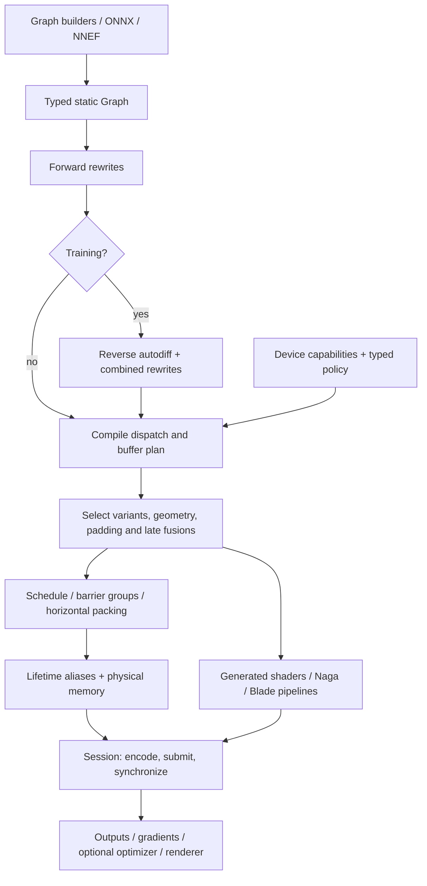

# Architecture: from tensors to a GPU step

Scope: development base `bd6be08` and September audit fixes. See
[results](results.md) for the older paper snapshot. Links below point to the
implementation; names are useful search anchors even as line numbers move.

## The pipeline and its owners

This is a dependency diagram, not an assertion that every implementation
function runs in precisely that order. Pipeline construction and buffer
creation are interleaved during session initialization. `build` obtains the
actual GPU context before compilation so capabilities are available; the
lower-level graph/compiler routines can still be exercised without a GPU.

| Owner | Responsibility and important boundary |
|---|---|
| [graph.rs](../../src/graph.rs), [nn.rs](../../src/nn.rs), [models/](../../src/models/) | Values, types, shapes, operators, parameters, model composition. |
| [autodiff.rs](../../src/autodiff.rs) | Reverse-mode derivative graph; precision-sensitive derivative regions. |
| [optimize.rs](../../src/optimize.rs), [outline.rs](../../src/outline.rs) | Semantic rewrites; optional e-graph extraction and repeated-region detection. |
| [compile.rs](../../src/compile.rs), [schedule.rs](../../src/schedule.rs) | Buffer references, dispatches, pointwise/reduction schedules, fusions and barrier grouping. |
| [codegen.rs](../../src/codegen.rs), [shaders/](../../src/shaders/) | WGSL/Naga modules and parameterized kernel implementations. |
| [runtime.rs](../../src/runtime.rs) | Hardware discovery, variant selection, pipeline keys, allocation, execution, readback, optimizer and checkpoints. |
| [memplan.rs](../../src/memplan.rs) | Logical lifetimes, pinned values, physical allocation reuse. |
| [train.rs](../../src/train.rs), [config.rs](../../src/config.rs), [cache.rs](../../src/cache.rs) | Public build/training workflow, explicit configuration and cached plans. |
| [Blade](https://github.com/kvark/blade/tree/b208f3b1f97196c2971436b5726e61e71b149c37) | Native GPU API objects, commands, synchronization and allocation semantics. |

## 1. What the graph knows

A `Graph` is a typed, static tensor dataflow graph. Nodes describe computation,
not immediately executed tensor operations. Shapes and storage types are known
before shader specialization. Parameters, external inputs, constants and
outputs have explicit roles; declared outputs also determine liveness. A
diagnostic that forgets `set_outputs` can accidentally report an incomplete
model after dead-code removal.

Storage supports f32, f16, u32 and block-quantized weights. `Q4_0` is a
historical name for the project's asymmetric scale-plus-minimum representation
(20 bytes per 32 weights); `Q8_0` uses 36 bytes per 32 weights. These names are
not a promise of GGML byte-format compatibility. Arithmetic, storage and
matrix-input precision are separate choices: an f32 tensor can be staged
through f16 matrix operands while accumulating into f32.

Views, indexing, broadcasting and materialization are represented through
specific supported operators, not an unrestricted strided tensor language.
The ONNX and NNEF importers lower subsets into this same IR. Import format
support therefore does not mean every model in that format is supported,
much less differentiable. Dynamic KV position is a runtime parameter;
changing arbitrary tensor shapes is not currently a public resize/replan API.

## 2. Autodiff is compilation, not a separate backend

For a simple dense layer, let `X` have shape `[B,K]`, `W` shape `[K,N]`, and
`Y = XW` shape `[B,N]`. If the loss supplies `G = dL/dY`, then:

- `dL/dX = G Wᵀ`, shape `[B,K]`;
- `dL/dW = Xᵀ G`, shape `[K,N]`;
- a broadcast bias has a batch reduction for its gradient.

These become ordinary graph nodes with transposed matmul variants and
reductions. Shared uses contribute gradients that must be accumulated. The
training builder differentiates the first declared output as the objective;
make that a scalar loss deliberately. Derivative nodes carry
`requires_full_precision` so later kernel selection can preserve the intended
arithmetic contract. Forward and derivative graphs then share the compiler.

This arrangement makes forward and backward fusion possible and avoids an
independent handwritten training backend. It still requires a correct
derivative rule for each supported operator and a correct kernel for each
lowered primitive. Inference-only operators remain: for example, cached
attention/cache writes and depthwise convolution cannot simply be
differentiated through the current implementation. `AddPerChannel` now has a
derivative; the older July audit predates that change. EfficientNet is an
inference example; folded-normalization ResNet is not standard batch-norm
training.

## 3. Rewriting: what to compute

The default optimizer is a deterministic greedy fixed-point rewriter.
Recognizable algebraic forms become fused nodes, such as SiLU and SwiGLU.
Optional egglog modes saturate windows, outlined repeated regions, or a whole
small graph. Outlining identifies repeated structure and reuses a region's
optimization result; it is not a lookup by model name.

The tensor-traffic extractor estimates reads plus writes from known tensor
sizes. Some e-classes with unavailable size information still use fallback
costs. This is a graph extraction objective, not a calibrated runtime model:
it does not see all occupancy, register pressure, layout conversion or
synchronization effects. Also, default greedy mode does not perform this
global cost-based extraction. Current rewrite ablations did not establish an
execution-speed advantage for equality saturation over greedy selection.

Keep the e-graph focused on semantic alternatives. A fast f16-input matrix
product is not numerically congruent with unrestricted f32 merely because
both implement matrix multiplication in real arithmetic. Even ordinary
floating-point rewrites need numerical tests; algebraic equivalence is not
bitwise equivalence.

## 4. Kernel archetypes: how to compute

The useful organizing families are pointwise, reduction, matmul, convolution
and attention. [Kernel archetypes](../kernel-archetypes.md) contains generator
details. "Small set" means shared implementation patterns, not five literal
shaders: substantial WGSL templates and specialized entry points remain.

Pointwise DAGs fuse expression trees so intermediates stay in registers.
Reductions map rows or chunks to workgroups; packing short rows raises useful
work per dispatch. Matmul variants cover ordinary and transposed operands,
small tiles, GEMV, quantized weights, cooperative tiles, and supported
prologues/epilogues. A prologue transforms loads; an epilogue transforms
accumulators before storing. Avoiding a complete intermediate write/read can
matter more than saving a few arithmetic instructions.

Convolution uses spatial or implicit-GEMM implementations and separate input
and weight derivatives; Winograd is an optional graph rewrite for eligible
shapes. Attention uses tiled online softmax to avoid materializing the full
quadratic score matrix. Its backward pass has dQ and fused dK/dV kernels.
These are reusable tensor algorithms, but writing and maintaining them is
still real specialization work. "No per-model kernels" must not be shortened
to "no handcrafted kernels."

Naga parses and validates generated shaders and supplies the representation
Blade consumes. The pinned implementation uses native extensions including
cooperative matrices: WGSL is an authoring/debugging boundary here, not a
claim that every shader runs in a standard browser WebGPU implementation.

## 5. Capabilities, correctness and selection

There are three distinct questions:

1. Can this device execute the candidate, with these tile dimensions, types,
   subgroup/workgroup requirements, and binding limits?
2. Does it satisfy this operation's precision and correctness policy?
3. Is it faster for this shape in its surrounding execution plan?

`runtime::auto_tune` currently answers capability questions; despite its name
it does not measure performance. `select_variants` owns promotion, fallback
geometry and padding. It still uses occupancy thresholds, a large-shape veto
for an 8×8 native-f32 tile, shape divisibility rules and small-tile cutoffs.
These are useful initial choices, not portable proofs of profitability.

`CoopPolicy::Auto` permits f16 matrix staging for forward work but retains
scalar f32 for full-precision derivative work when native-f32 tiles are
unavailable. `AllowF16` explicitly relaxes that protection. The compensated
hi/lo generator remains in the source but is no longer automatically selected
for derivatives. Experimental cooperative flash backward is separately
opt-in; the frozen accelerated paper contract did not enable it.

For strict f32, use f32 storage and disable reduced-input cooperative paths,
including attention; use the frozen harness's explicit settings when
reproducing its contract. "f32 outputs" alone is not a sufficient setting.

The pipeline map now uses a unified variant key. Lookup still tries a
candidate hierarchy, so it is not yet a pure exact-key contract. Geometry,
bindings, epilogues, horizontal packing and precision must agree with the
selected pipeline. The September audit fixed a violation at the horizontal
fusion boundary: a single-output scalar fallback is not a legal fallback for
a packed multi-output dispatch.

## 6. Scheduling and memory

Dispatch dependencies are organized into pass/barrier groups. Independent
same-input matmuls in an eligible group can be horizontally packed, with `z`
selecting a sibling. This reduces dispatch count without inventing a new
model operator, but changes pipeline bindings and geometry.

Lifetime aliasing is computed at barrier-group granularity. Two logical
buffers can share physical memory only if a synchronization boundary strictly
separates the old tenant's last use and the new tenant's first write. Merely
appearing earlier in a list is insufficient for dispatches that can overlap.
Parameters, inputs, outputs, gradients, constants, derived weights and
cross-step/read-modify-write state are pinned as appropriate. Pinning prevents
alias reuse; it does not require host-visible memory.

Parameters use shared storage. Intermediates, gradients and optimizer state
can be device-local; the current Blade pin supplies `DeviceTransient` for
that allocation path. Diagnostics and checkpoints use staging when necessary.
Metal private memory must never be treated as a host pointer. Buffer padding
must be included in physical allocation and alias-safety reasoning.

The planner preallocates tensor storage; this is not a guarantee of zero CPU
heap allocation during a step. Memory-budget checks reserve headroom when a
budget is available, but cannot prevent another process consuming memory
after the check. There is no general rematerialization, paging, distributed
execution or multi-GPU memory planner. Adam state is currently created for
trainable sessions even when the immediate workload does not need Adam.

## 7. Session execution, training and embedding

`Session::step` encodes the fixed plan and submits it. It waits for a previous
outstanding step of the same session before reusing resources, but completion
of the new submission is asynchronous until a wait/readback requires it.
This is not native captured-graph replay. Optional SGD, Adam/AdamW, LaProp,
clipping, gradient accumulation and parameter learning-rate multipliers live
in the session runtime; the high-level `Trainer` exposes a narrower subset.

A shared Blade context and GPU buffer pieces let a renderer consume inference
without CPU readback. Ownership and synchronization still matter when an
external application accesses those resources. The DinoVision demonstration
trains on a host and deploys the resulting checkpoint to Quest inference; it
is a useful integration result, not an Android training benchmark.

The eager helper evaluates a growing graph with the same kernels and disabled
optimization. It can rebuild sessions as the graph grows; it is a debugging
workflow, not a fully dynamic low-overhead tensor interpreter. Named-node
provenance, plan dumps and first-NaN/Inf diagnostics make compilation visible.
Aliased or fused-away intermediate reads return errors rather than pretending
the original tensor is still materialized.

## 8. Configuration, cache and state hazards

The core uses typed configuration; `from_env` is the explicit environment
boundary. The semantic build cache stores a pre-runtime plan. Its key includes
the graph and relevant build configuration, now including rewrite mode, cost,
cutoff and Winograd policy. Cache format 4 invalidates older entries.

This cache is not a persistent performance database. Measured winners need
stronger device/driver/compiler identity and validation provenance. The current
opt-in `Session::tune` measures family-wide coop-to-scalar flips; it cannot
discover candidates rejected before promotion and does not persist winners.
Build-time tuning runs before user data upload. Calling tuning later can
advance optimizer, accumulation or KV state because it executes real steps.
Do not treat it as an observational, side-effect-free query. A safe scratch
execution design is a prerequisite for default-on tuning.

Checkpoints serialize current physical buffers, including padding. Load
validation has improved, but restoring is not transactional and cross-plan
padding can differ. Stable logical-tensor serialization and validate-all-
before-write restore are still needed for a robust cross-device deployment
contract. See the [audit](../audit-2026-09.md) for concrete exit criteria.
